# WEB-ToDoList

IUT Paris Descartes - 2020 - Enseignant : PEROIS Cyrille.

## Développement en JavaScript d'une application web de type To Do List.

Dans le cadre du cours de Web, Cyrille Perois a proposé de développer une application web de type *To do list*.

## Auteurs

BERTHIER Nicolas : nicolas-berthier@orange.fr  
ESCOFFIER Vincent : alainvincentesc@gmail.com  
JALLAIS Adrien : adrien.jallais@protonmail.com  

## Informations générales

### Objectif

L'objectif de ce projet est d'évaluer notre capacité à développer une **application web complète** en utilisant les technologies et concepts de développement web client et serveur vus en cours.

Nous travaillons pour une entreprise fictive qui décide de créer une application web de gestion de **To do list**. L'application permet à une personne de créer un compte, puis de créer et gérer des listes de tâches à effectuer. L'application a été développée en tant qu'application **client riche** communiquant avec une **API** et s'adapte à la taille du support client (**design responsive**).

Les pictogramme nous ont été fournis par Cyrille Perois.

## Résultat

### Fonctionnalités *core*

#### Inscription

L'utilisateur peut créer un nouveau compte sur l'application. Pour cela, il devra fournir son adresse e-mail ainsi qu'un mot de passe. Le mot de passe de l'utilisateur est stocké en base de données de manière sécurisée. Les éventuelles erreurs (champ vide, e-mail déjà utilisé...) sont affichées à l'utilisateur. Une fois l'utilisateur inscrit, un message de succès lui est affiché, et un e-mail de confirmation contenant son email lui est envoyé.

Maquette :

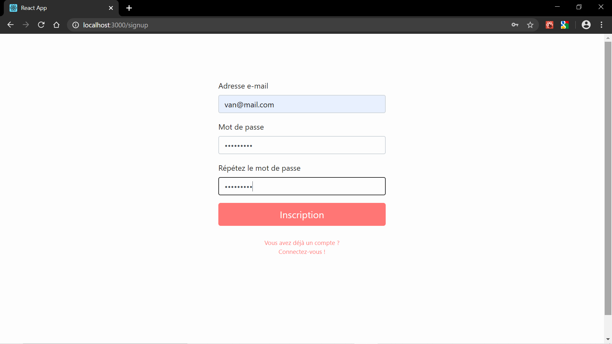
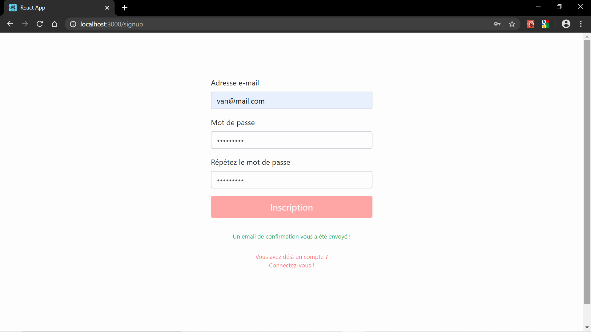


#### Connexion

Une fois inscrit, l'utilisateur peut se connecter sur son compte. Le formulaire de connexion est d'ailleurs la page sur laquelle un utilisateur non authentifié arrive par défaut lorsqu'il tente d'accéder à l'application.

Sur cette page, l'utilisateur peut saisir son adresse e-mail et son mot de passe pour se connecter à l'application. Un lien lui permet d'accéder à une page "mot de passe oublié" (voir fonctionnalités secondaires), et un autre lui permet d'accéder à la page d'inscription.

Maquette :

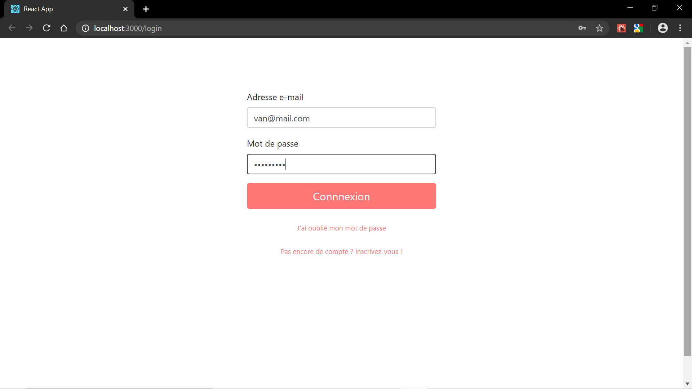
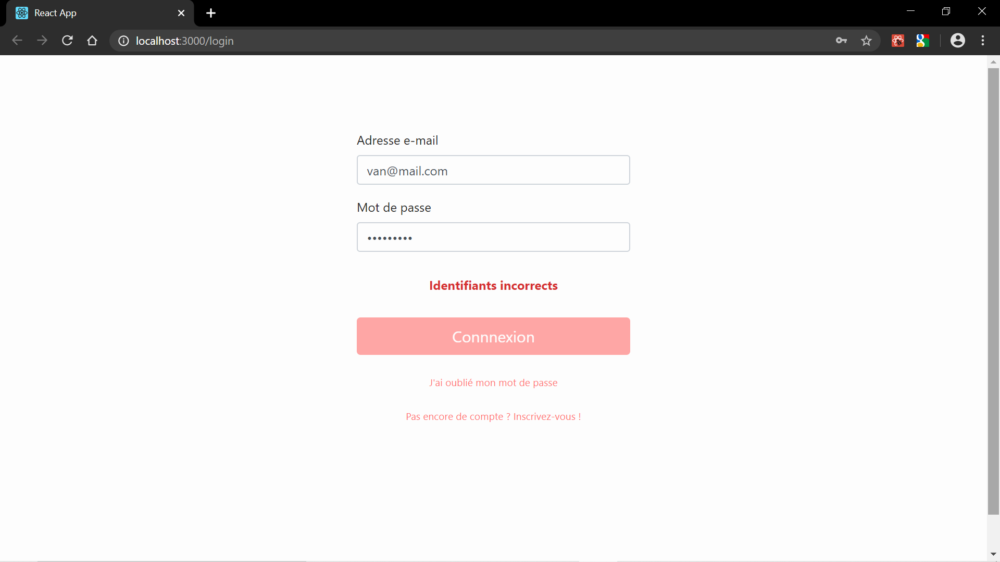

#### Page d'accueil

Une fois authentifié, l'utilisateur arrive automatiquement sur la page d'accueil. Sur cette page sont listées toutes les tâches (peu importe à quelle liste elles sont rattachées) qui ont une date d'échéance définie (plus de détails dans la description ci-dessous), par ordre croissant de date. Chaque tâche peut être définie comme terminée (en la cochant) ou éditée (en cliquant dessus) directement à partir de cette page.

Maquette :

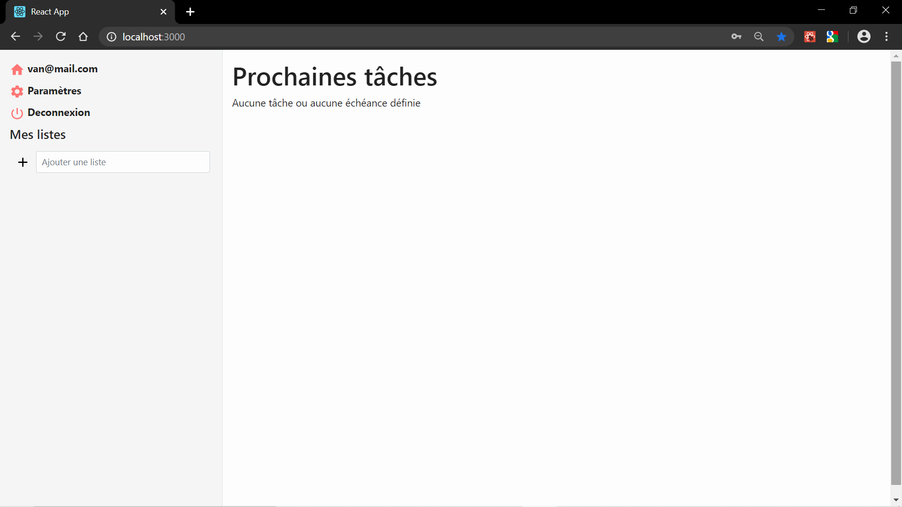
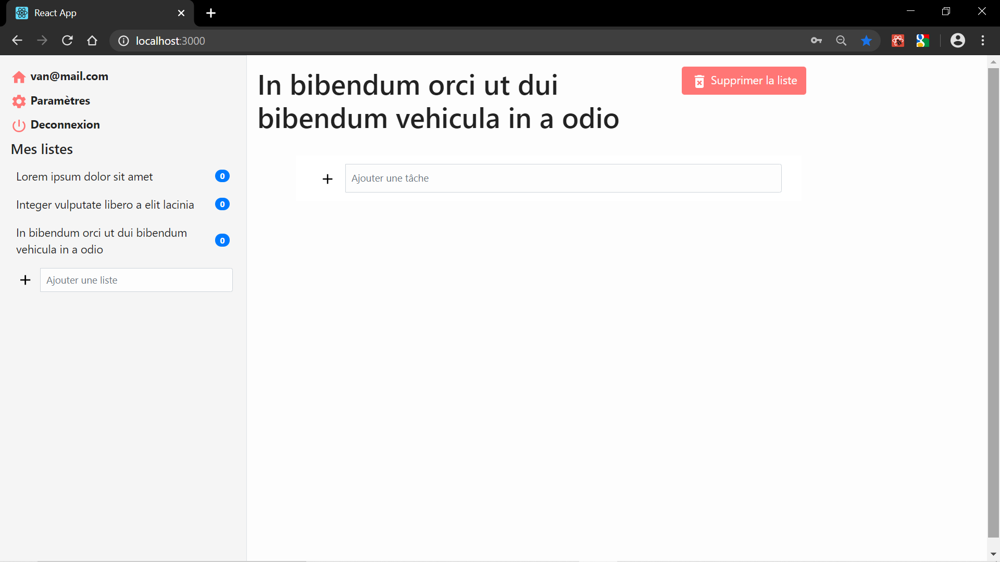

#### Page d'édition d'une liste

Pour accéder à cette page, l'utilisateur clique sur une liste dans le menu.

Sur cette page, l'utilisateur peut ajouter, définir comme terminée, éditer ou supprimer des tâches dans une liste, ainsi que supprimer une liste.

Pour ajouter une tâche, l'utilisateur peut cliquer sur "Ajouter une tâche". Il peut alors saisir le nom de la nouvelle tâche et appuyer sur Entrée, ou cliquer sur le bouton "+". L'ajout d'une tâche remet automatiquement le focus sur le champ "Ajouter une tâche", de manière à ce que l'utilisateur puisse ajouter plusieurs tâches d'affilé facilement.

Pour définir une tâche comme terminée, l'utilisateur peut la cocher en cliquant sur la checkbox située à gauche de la ligne d'une tâche. L'utilisateur peut cocher et décocher la tâche à sa guise.

Pour éditer une tâche, l'utilisateur doit cliquer dessus. Un volet s'ouvre alors pour lui permettre de renseigner les différentes caractéristiques d'une tâche :

+ Nom (ce qu'il a saisit lors de la création de la tâche)
+ Liste d'étapes (voir fonctionnalités secondaires)
+ Date d'échéance : une date à laquelle l'utilisateur estime que cette tâche doit avoir été effectuée
+ Note : un champ de texte libre dans lequel l'utilisateur peut saisir des informations quelconques à propos de la tâche

Pour supprimer une tâche, l'utilisateur doit cliquer sur le picto "poubelle" situé sur la ligne d'une tâche. La suppression est immédiate, sans confirmation.

Pour supprimer la liste, l'utilisateur doit cliquer sur le bouton "Supprimer" situé à côté du nom de la liste. Une modale de confirmation doit s'afficher, et l'utilisateur peut alors cliquer sur "confirmer" ou "annuler". La confirmation supprime la liste et renvoie l'utilisateur sur la page d'accueil. L'annulation ferme simplement la modale.

Maquette :

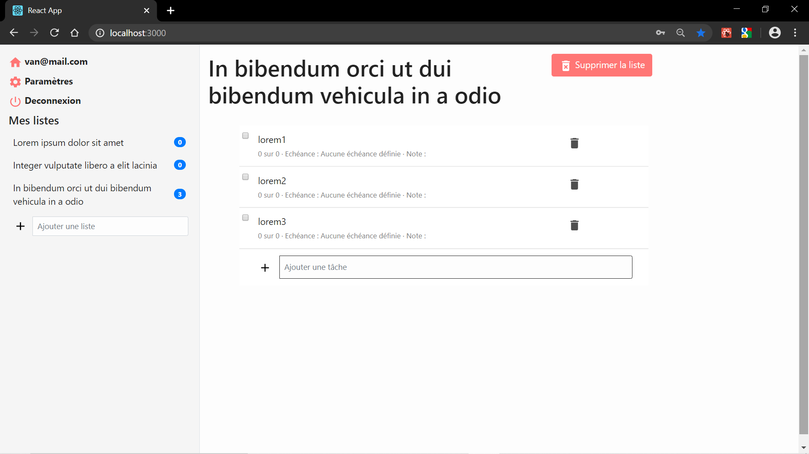
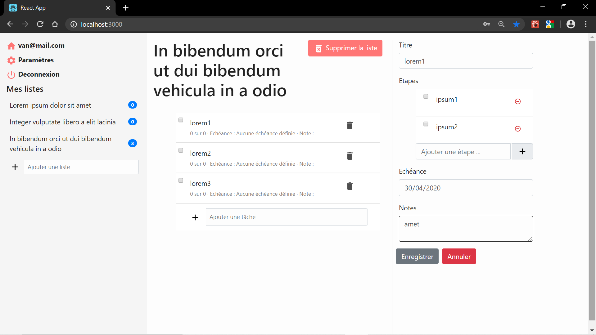
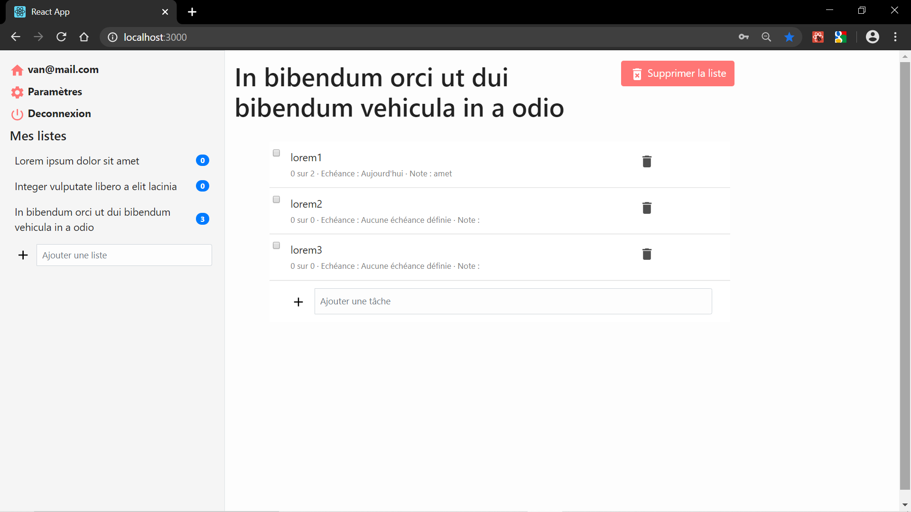

#### Page paramètres

Sur cette page, l'utilisateur peut modifier ses informations : adresse e-mail et mot de passe.

Pour modifier son adresse e-mail, l'utilisateur doit saisir sa nouvelle adresse e-mail et la confirmer, puis cliquer sur "modifier l'adresse e-mail".

Pour modifier son mot de passe, l'utilisateur doit saisir son mot de passe actuel ainsi que le nouveau mot de passe et le confirmer, puis cliquer sur "modifier le mot de passe".

Lorsqu'une information a été modifiée avec succès, un message indiquera que le changement a été effectué. Les erreurs sont gérées et indiquées à l'utilisateur (adresse e-mail invalide, mauvais mot de passe actuel, nouveau mot de passe et confirmation qui ne correspondent pas...)

Un audit sur ces changements est réalisé par des *triggers* en pgplsql, afin de permettre retrouver une ancienne adresse mail si besoin.

Maquette :

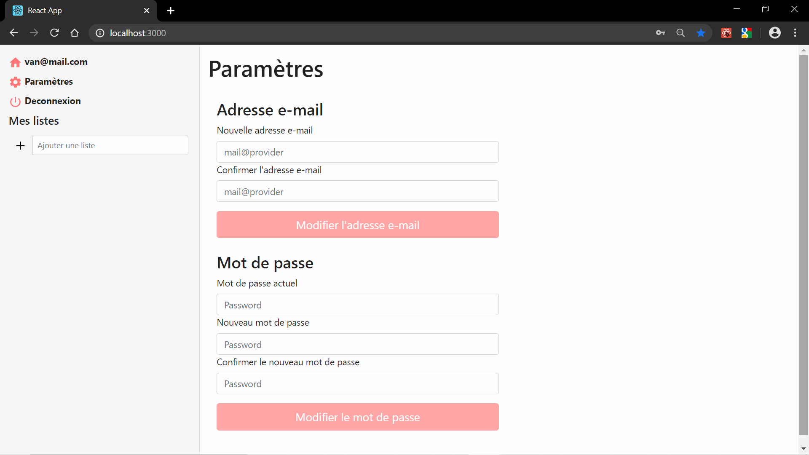
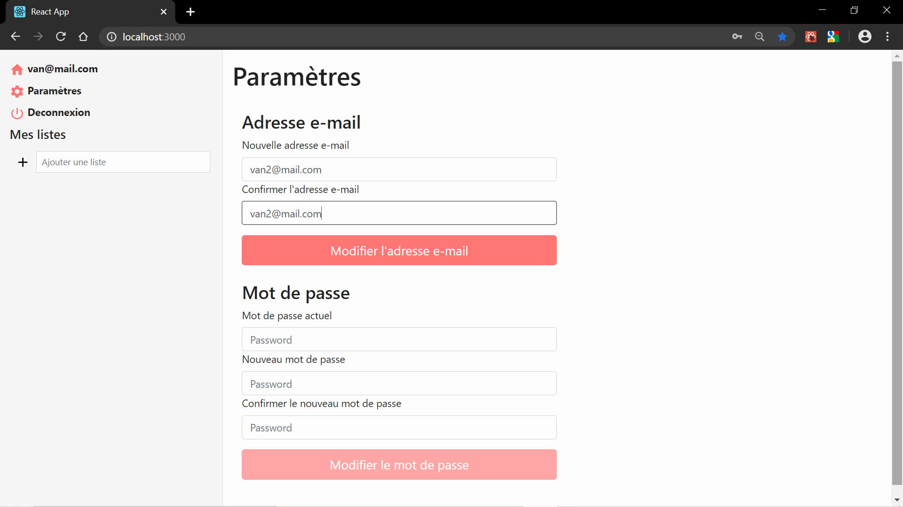
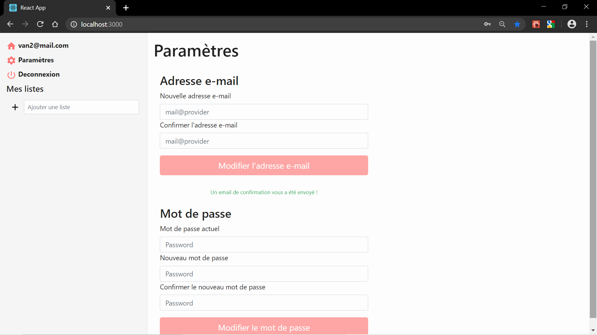
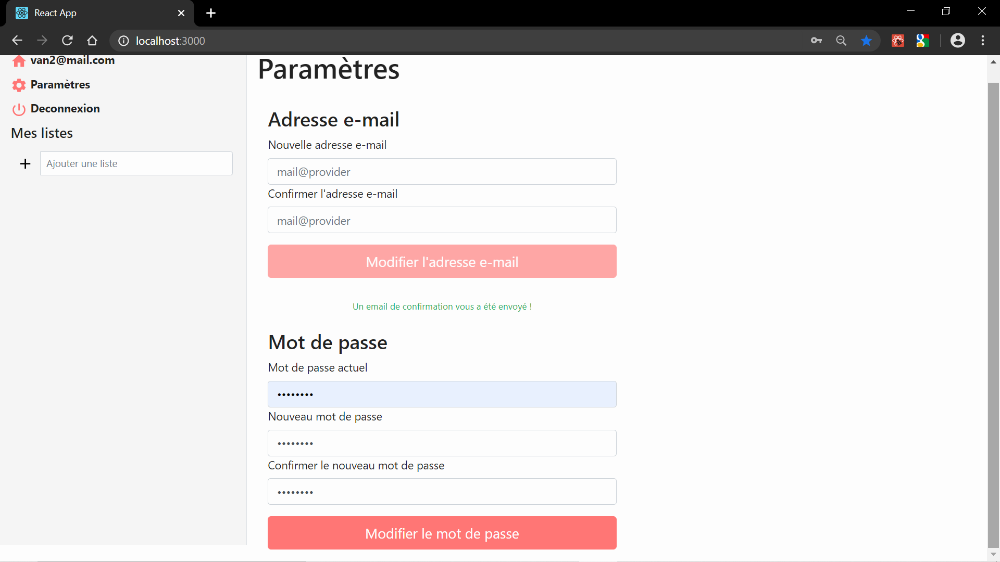

#### Menu

Sur chaque page, un menu est affiché (dans un volet à gauche de la page en desktop, via le click sur un bouton dans le header en mobile, voir maquettes de la page d'accueil). Dans ce menu, on trouve :

+ Un lien permettant de revenir à la page d'accueil
+ Une section "mes listes" dans laquelle se trouve l'ensemble des listes de l'utilisateur (le click sur une liste renvoie sur la page d'édition de cette liste). Pour chaque liste est aussi affiché le nombre de tâches qu'il reste à effectuer. Ainsi qu'un formulaire permettant de créer une nouvelle liste (en saisissant son nom). La création d'une nouvelle liste envoie automatiquement sur la page d'édition de cette liste
+ Un lien "paramètres" qui renvoie vers la page paramètres
+ Un lien "déconnexion" qui déconnecte l'utilisateur et le renvoie sur le formulaire de connexion

### Fonctionnalités *secondaires*

#### Page "mot de passe oublié"

Lorsque l'utilisateur est sur le formulaire de connexion mais a oublié son mot de passe, il peut cliquer sur un lien "j'ai oublié mon mot de passe". Il arrive alors sur une page qui lui demande son adresse e-mail. Une fois son adresse e-mail saisie, un e-mail lui est envoyé avec un lien lui permettant d'accéder à une page sur laquelle il pourra définir un nouveau mot de passe.

*L'email est en cours de construction.*

Maquette :


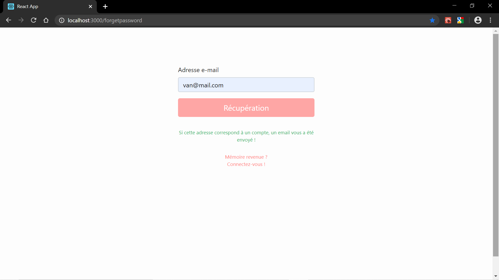

#### Etapes d'une tâche

L'utilisateur peut définir une liste d'étapes pour chaque tâche. Une étape est en quelques sortes une sous-tâche. L'utilisateur peut ajouter le nombre d'étapes qu'il veut pour chaque tâche, les cocher, les supprimer (sans confirmation).

Maquette :


## Technologies, architecture utilisée

Notre environnement de développement s'est fait avec **nodeJS**.

+ côté **backend** :
  + afin de prévoir le déploiement sur mobile, elle a été développée sous forme d'une **API**
  + la gestion de la base de données se fait avec le langage **pgplSQL**
  + les mots de passes stockés sont hachés avec **bcrypt** 
  + le control d'accès de certaines routes est réalisé avec **jsonwebtoken**
  + l'envoie d'email peut se faire avec différent services : gmail, ethereal, mailtrap 
+ côté **frontend** :
  + la technologie de **React** a été utilisée 
  + les classes css de **Bootstrap** ont été utlisées
+ des deux côtés :
  + le framework **express** a été utilisée pour la gestion de route

## Détails sur les branches

+ La branche **master** n'a pas les mots de passes en hashés, ansi les utilisateurs peuvent recevoir par mail si l'on oublié, leur mot de passe pour se connecter.
+ La branche **iop** hash les mots de passe, ansi les utilisateurs n'ont pas connaissance d'un mot de passe qui leur permet de se connecter lorsqu'ils en font la demande après un oubli.
+ La branche **vbn** est une branche en développement afin de mettre en place un email contenant un lien permettant de mettre à jour son mot de passe.

## Utilisation de l'application

Les commandes vous permettrons d'utiliser notre application.

### Prérequis

Il faut avoir :
    + souscris à au moins un des services de mail suivant : 
        + [gmail](https://mail.google.com/)
        + [ethereal](https://ethereal.email/)
        + [mailtrap](https://mailtrap.io/)
    + soucris à un service de base de données en pgplSQL, comme :
        + [ElephantSQL](https://customer.elephantsql.com/login)

### Téléchargement du dépôt

Le téléchargement se fait avec l'aide de git. Il sera téléchargé dans un dossier `ToDoList` créé dans le repertoire où sera lancé votre terminal.
La branche téléchargée sera la branche master.

```
mkdir ToDoList
git init
git remote add tdl https://github.com/Naedri/WEB-ToDoList.git
git pull tdl master
```

Après la fin du téléchargement, vous pouvez fermer le terminal.

### Indication des détails de connexions pour les services

Ensuite, il faut définir ajouter les détails de login dans des fichiers :

1. `ToDoList\server\services\users\.env`
   
   + contenant les mots de passes et l'identifiant de votre service d'email
   + comme ci-dessous avec le service gmail :
     + `PASSWORD_gmail=tonmdp`
     + `EMAIL_gmail=tonadresse@gmail.com`
   + modifier commentaires aux lignes 124 à 127 du fichier `ToDoList\server\services\users\email.js` en fonction de votre service mail
     + si vous avez choisi gmail, vous devez accepter d'utiliser des applications moins sécurisées à ce [lien](https://myaccount.google.com/lesssecureapps)

2. `ToDoList\server\services\db\.env`
   
   + contenant les indicatons de la base de données ElephantSQL suivantes : 
     + `USER=xxx`
     + `HOST=yyyyyyy.db.elephantsql.com`
     + `DATABASE=xxx`
     + `PASSWORD = dddddd`
     + `PORT=5432`
     + `SECRET=ssssss`

### Lancement du serveur

Terminal 1 pour installer les dépendance

```
cd ToDoList/server/
npm install
```

Terminal 2 pour initiser la base de donnée

```
cd ToDoList/server/db/
node import.js
```

Terminal 3 pour lancer le serveur

```
cd ToDoList/server/
node app.js
```

### Lancement du client

Terminal 1 pour installer les dépendance

```
cd ToDoList/Client/
npm install
```

Terminal 3 pour lancer le client

```
cd ToDoList/Client/
npm start
```
